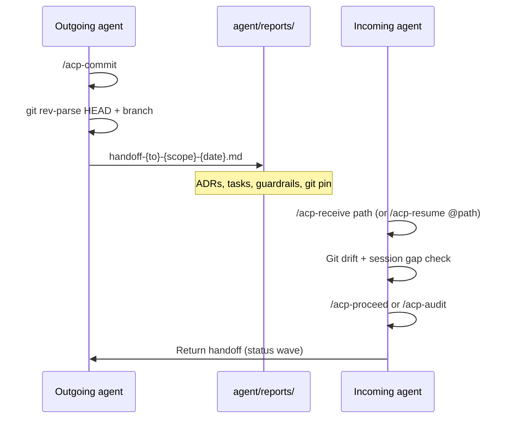

# Cross-Agent Handoff (ACP Enhanced)

> **Status:** Shipped — ACP v6.23.0 (M67)  
> **Design:** `agent/design/cross-agent-handoff-protocol.md`  
> **Audit:** F-077 / audit-077 (local `agent/reports/` — gitignored after ADR-27)  
> **Field evidence:** consumer-project audit-245 + M51 exemplar (external reference project)

---

## Overview

ACP supports two handoff modes:

| Mode | Use when | Delivery | Command |
|------|----------|----------|-------------------|
| **executor** | Same repo, different agent/model (plan → implement, implement → audit) | Disk file in `agent/reports/` | `/acp-handoff --mode executor --to <executor>` |
| **cross-repo** | Problem transfer to another codebase | Chat-primary (optional disk) | `/acp-handoff --mode cross-repo` (default) |

**`/acp-report`** = session summary for humans. **`/acp-handoff`** = structured transfer to the next agent.

---

## Ritual diagram

---

## Outgoing ritual (executor mode)

1. **`/acp-commit`** — persist session to `sessions.md`
2. Record **`git rev-parse HEAD`** and branch
3. **`/acp-handoff --mode executor --to <target>`** — write to `agent/reports/handoff-{to}-{scope}-{YYYY-MM-DD}.md`
4. Include (proposal §4 template):
   - Model / executor requirement
   - Locked decisions (ADR refs — do not re-litigate)
   - Plan reference (milestone, route IDs, task sequence)
   - **What NOT to do**
   - State files to update on completion
5. Push if receiving agent needs remote access

---

## Incoming ritual

1. **`/acp-receive <path>`** or **`/acp-resume @handoff.md`** — load handoff, verify git pin, print assignment checklist
2. Compare handoff `git_commit` vs `git rev-parse HEAD` — if drift, review `git log pin..HEAD`
3. Compare handoff date vs last `sessions.md` entry
4. Confirm mode: **Implement** vs **Audit only** vs **Document only**
5. **`/acp-proceed`** or **`/acp-audit`** — do not re-litigate locked decisions

---

## Return handoff

When finishing a wave or blocking, write:

`handoff-{original-from}-{scope}-status-{YYYY-MM-DD}.md`

Include: completed tasks, commits, HUMAN gates, open questions.

---

## Filename conventions

| Pattern | Purpose |
|---------|---------|
| `handoff-{to}-{scope}-{date}.md` | Outgoing executor handoff |
| `handoff-{from}-{scope}-status-{date}.md` | Return / status handoff |
| `HANDOFF-LATEST.md` | Copy of most recent (P2, route-194) |

---

## Exemplars (consumer-project field project)

These files live in the consumer-project repo and demonstrate production patterns:

- Claude → Cursor: `handoff-cursor-composer25-m51-2026-07-13.md`
- Cursor → Claude audit: `handoff-claude-m47-m48-plan-audit-2026-07-12.md`

Path: local `agent/reports/` in the consumer repo (gitignored on this public ACP clone after ADR-27)

---

## Related commands

| Command | When |
|---------|------|
| `/acp-commit` | Always before outgoing handoff |
| `/acp-handoff` | Create handoff (v2 dual mode) |
| `/acp-receive` | Load + verify incoming handoff |
| `/acp-resume` | Session start; optional handoff path |
| `/acp-status` | Snapshot for handoff context |

---

## Upstream tracking

- **Feedback:** `agent/feedback/feedback-007-cross-agent-handoff-protocol.md`
- **Milestone:** `agent/milestones/milestone-67-cross-agent-handoff-protocol.md`
